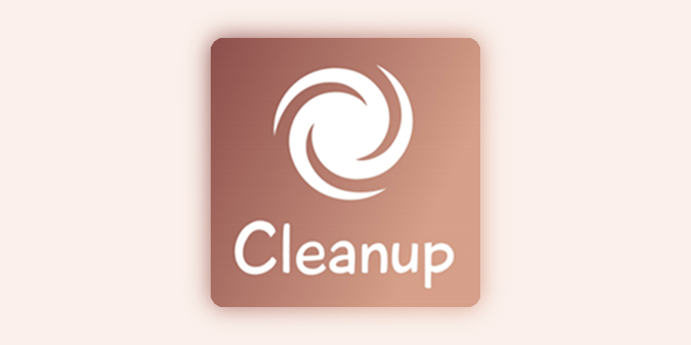
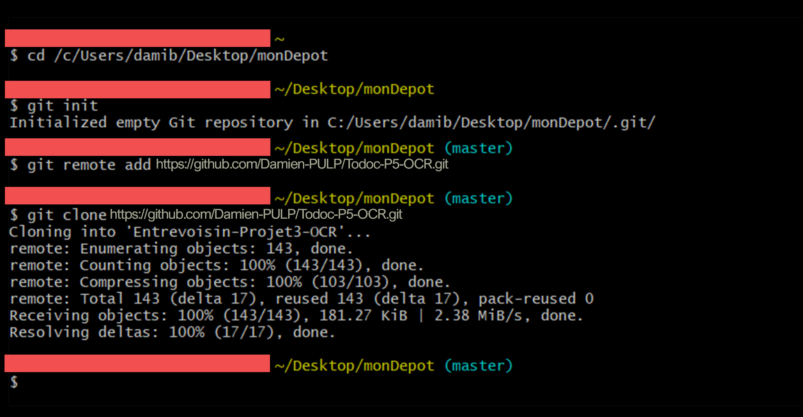
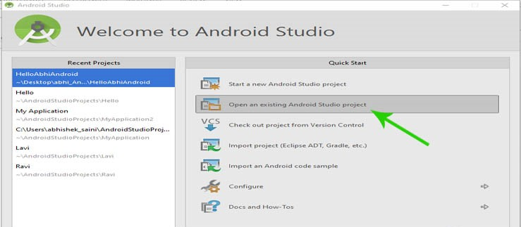
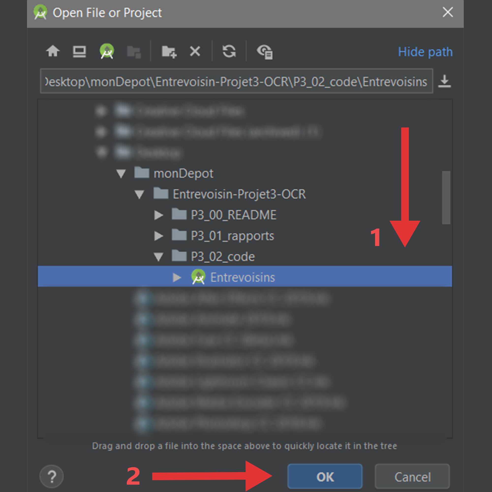
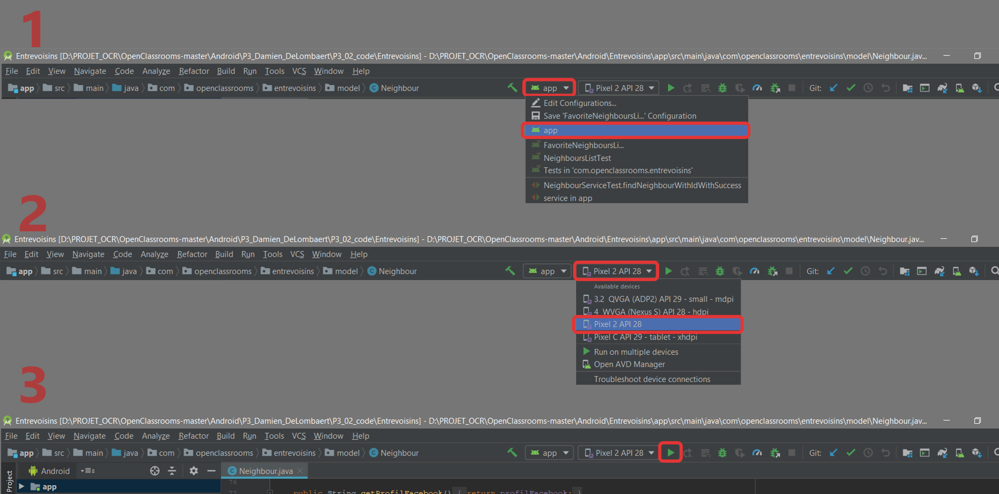

This is Todoc, the project 5 of OCR - Developper android
Application for Cleanup
## 1. Download the project 
### Use git 
- Create a folder for the depot of the project 
- Open gitBash
```
$ cd Path depot
$ git init 
$ git remote add MAREU https://github.com/Damien-PULP/Todoc-P5-OCR.git
$ git clone https://github.com/Damien-PULP/Todoc-P5-OCR.git
```

### Use download ZIP
- Download the github project on "Download zip"
- Unzip the folder.
## 2. Open the project
### Open Android studio

### Select the path of project of the depot

## 3. Build and Run
1. Select 'app'
2. Select a emulator 
3. Press the green triangle for Run

## The app will launched
